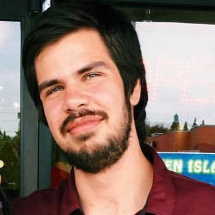

<!-- -->

# Who I am #

I'm a second year graduate student at Yale University working in Wright Lab with [David Moore] (https://campuspress.yale.edu/moorelab/) on the [nEXO experiment] (https://nexo.llnl.gov). nEXO is a proposed 3 tonnne Liquid Xenon time projection chamber that will search for a hypothetical process called [neutrinoless double beta decay (0vbb)] (https://en.wikipedia.org/wiki/Neutrinoless_double_beta_decay). Discovery of this process could help shed light on the neutrino -  a very strange fundemenatal particle that is currently the focus of any open questions in physics.

My primary focus in the collaboration is the devleopment of charge simulation and analysis algorithms. I aim to improve the algorithms nEXO uses to simulate the charge collection in our detector as well as the algorithms we will use to analyze our charge collection data. Aside from banging my head against my desk while I code, I also do some work on our lab improving the purity monitor we devlepped with the addition of a muon tagger, and re-coding a multichannel spectrum analyzer we use in of our many SiPM studies - this too inovles a lot of head banging.

# Who I was #

Before I began my PhD work at Yale I spent a year as a a Post-Bac working at the Lawrence Berkeley national lab. There I worked in the Accelerator and Applied Technology [(ATAP) Division] (https://atap.lbl.gov). I was part of the Berkeley Lab Laser Accelerator (BELLA) simulation and modeling team. I was responsible for devloping an algorithm to solve Maxwell's equations with the addition of photon loop QED corrections and impimenting them into the [WarpX Particle in Cell (PIC) simulation software.](https://warpx.readthedocs.io/en/latest/)

Before my gap year, I earned B.As in Physics and Mathematics from the University of California Berkeley in 2019. There, I worked under Prof. Daniel McKinsey on the Xenon Breakdown Apparatus (XeBrA), which was part of the larger Lux-Zeplin (LZ) dark matter collaboration. My undergraduate honors thesis was an initial study of electroluminescence in liquid Argon.

When not working on physics, I enjoy reading and playing video games. I'm currently playing Gorilla Game's **Horizon: Forbidden West** and looking for a good book to read.

# Publications
* nEXO collaboration, _Development of a 127Xe calibration source for nEXo-, (https://arxiv.org/abs/2201.04681)

 * L. Tvrznikova et al., _Direct comparison of high voltage breakdown measurements in liquid argon and liquid xenon_,
  [JINST. vol. 14, no. 12, PI12018-P12018 (2019)](https://iopscience.iop.org/article/10.1088/1748-0221/14/12/P12018)

* Richardson, G. (2016). _Betrayal in Brussels: The Conference that Changed International Science_. [UC Berkeley: Library](https://escholarship.org/uc/item/2302498d)
